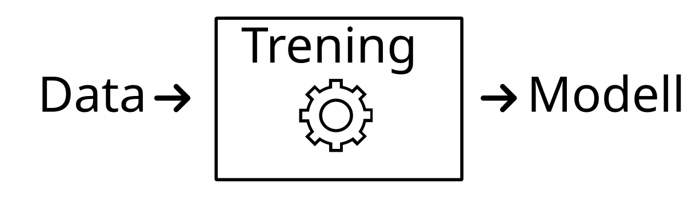
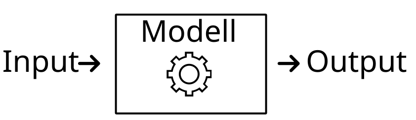
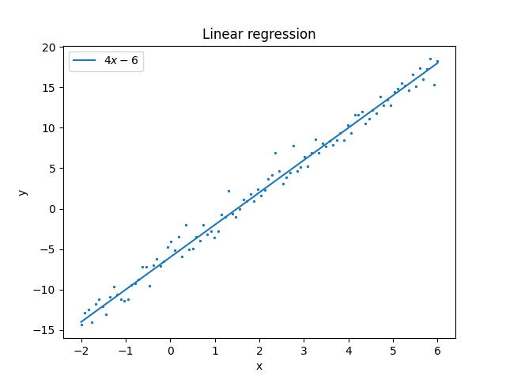
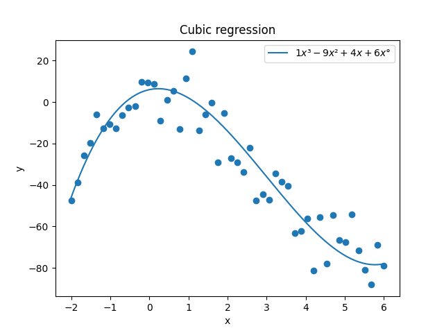
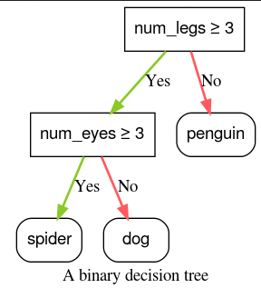
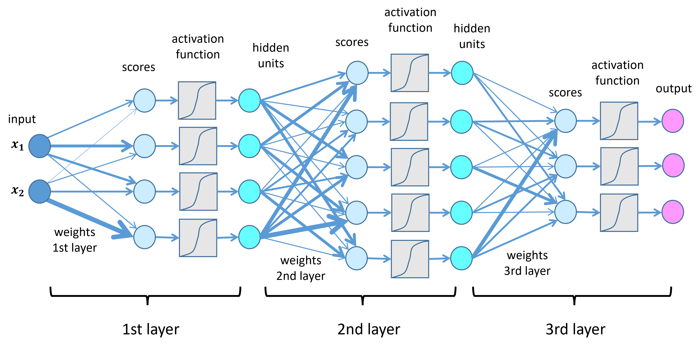

# Klassisk programvare vs ML-systemer

- Klassisk programvare:
  - Program tar input
  - Program kjører (logikk)
  - Program produserer output
- Koden er logikken

# ML-systemer

* Treningsdata blir brukt til å lage en statistisk modell

# ML-systemer

* Bruker gir input til systemet som videresender(\*) til modell
* Systemet får output fra modell og gir(\*) til bruker

# Hva er en modell?

# Hva er en modell?

# Hva er en modell?

# Hva er en modell?

# ML-systemets 4 komponenter

1. Treningssystem (kode + infrastruktur)
2. Treningsdata
3. Trent modell (vekter)
4. Tjenestesystem (ML-systemet som bruker modellen)

# Treningdata: den problematiske delen

- Treningdata:
  - Store nettbaserte innhentinger, bøker, kode, proprietære kilder

- Selv om datasett er _tilgjengelige_:
  - inneholder opphavsrettsbeskyttet/proprietært innhold

- I Norge kan det være ulovlig å
  - Laste ned, lagre, redistribuere

- Åpenhet vs. personvern, opphavsrett, forretningshemmeligheter, ulovlig materiale

- Åpne data krever attribusjon (BY)

- Treningskostnader for LLM-er

# Forklarbar KI og inspeksjon

Hvorfor? (XAI)

- Åpne modeller:
  - Inspeksjon av vekter: mekanistisk forklarbarhet, bias, diskriminering
  - Finjustering for nye oppgaver
  - Kontroll over input, output, prompt

- Transparens og kontroll
  - Politisk innhold

# Kontroll over innganger og utganger

* Hva sendes til modellen?  (er noe injisert?)
* Hva returneres fra modellen? (er noe sensurert?)
* Tjenesteleverandør har
  * Økonomiske og politiske interesser
  * (se: Cambridge Analytica)

# Forgiftede data og manipulering

* Inneholder treningsdata _gift_?
* Skjevt innhold?

# Fordeler og ulemper

Fordeler

- Transparens og revidering
- Vitenskapelig reproduksjon
- Lokal kontroll
- Finjustering og overføringstrening

Ulemper

- Personvern- og opphavsrettkonflikter
- Misbruk av kraftige åpne modeller
